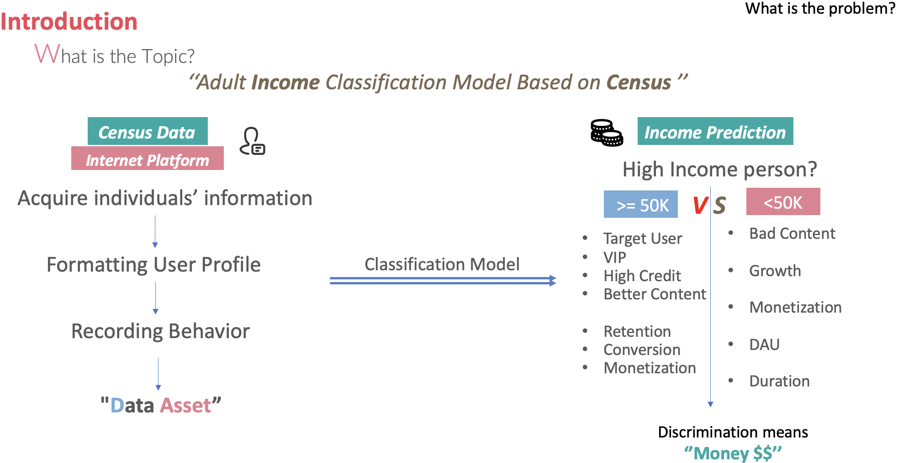
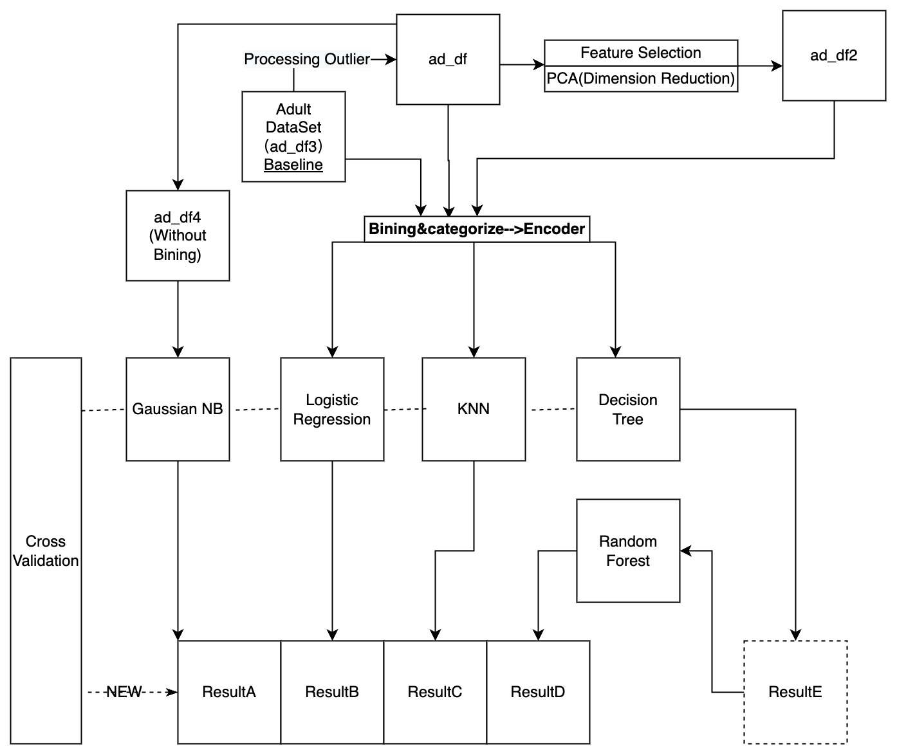
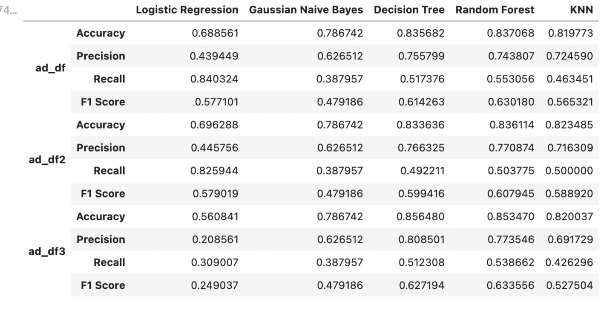
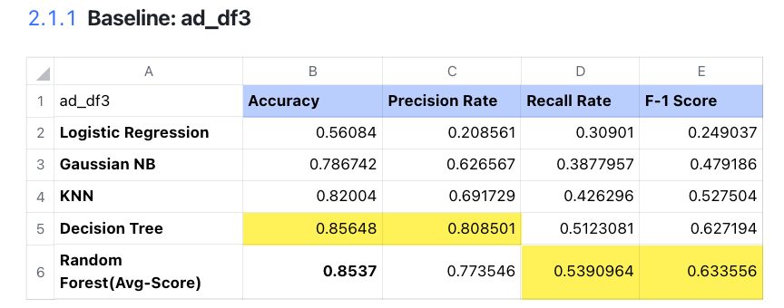
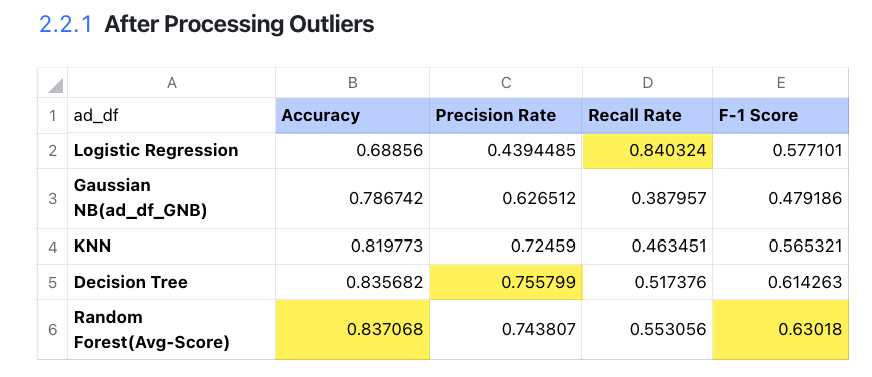
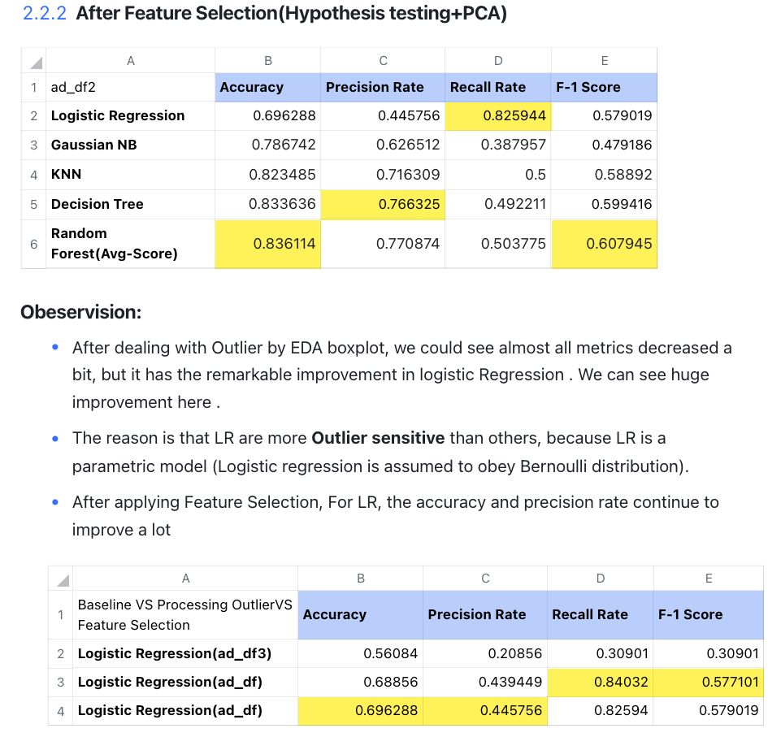
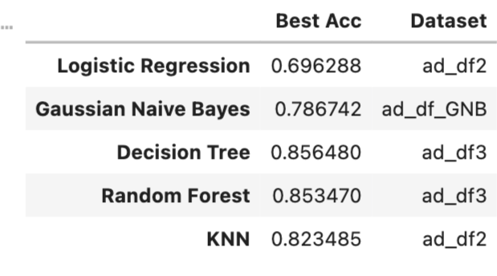
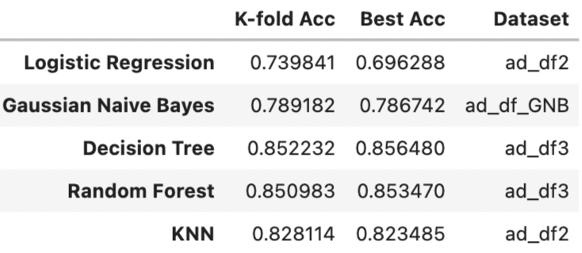
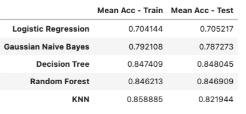

Team:
- **Rundong Xu**
- **Yuxi Chen**
- **Haotian Chen**

# Adult_Income_ML-Project
 

## 1.Introduction

**Objective**: Basically, in this project, the objective of this machine learning project is to predict whether a person makes over 50K a year. We are going to focus on building an 'income' classification model. All of these are the prerequisite of default risk modeling.

**Method**: For one thing, we apply EDA to understand data from univariate to multivariate analysis, apply Feature Engineering to Bining, encode and scaling, also apply hypothesis testing to do feature selection. For another, we write 7 algorithms scratch without using Sklearn, which includes 1 dimension reduction, and 6 classification algorithms to train our model and evaluate the goal by metrics. 

**Comparation**: Finally, we set the 4 dataset scenario including baseline(ad_df)and the other 3 dataset by improvement, and compare the model from metrics perspective, bias-variance-tradeoff perspective, optimization perspective and space and time consumption perspective to conduct model selection and explore the interpretability.

## 2.Bussiness Value

- All we know that We are naked in Big data society, The user information are collected in every APP and Website includes data on age, gender, country of origin, marital status,marriage, education etc.) when we login in to them.
- Typically, all of this information(Data Asset) would be widely used by Bank, Fintech company and IBD for deciding whether to approve their application of card and account,  evaluating cardholder's credit, anticipating risk of default and fraud in finance, differentiating the value of bond or interest and commission rate for different applicators and even introducing typical monetization method--- ***Advertisement***.

## 3.About Data 

**3.1 Data Source:** [Adult_data_UCI](https://archive.ics.uci.edu/ml/datasets/adult) 

- It is the multivariable data set. And it has 48842 instances and 14 attributes. Among the 15 indicators, 6 indicators are continuous indicators, and the remaining 9 indicators are discrete indicators.

**3.2 Input Data:**

- We can see that there are 3 files:"adult.names" , "adult.data" and "adult.test",on Adult dataset downloaded from [Adult_data_UCI](https://archive.ics.uci.edu/ml/datasets/adult) 
Therefore, We need to preprocess and merge all of 3 files into 1 dataset in order to do EDA and Feature Engineering and so on.
Here, we use powerful tools-- Regular Expression to deal with this problem.

## 4.Exploratory Descriptive Analysis(EDA)
### 4.1 Processing N/A Value
- Among features, the 'workclass' , 'occupation' , 'native-country'  contain N/A Values

 

- Typically, we choose to use **"Mode"** value repectively to fill these N/A values.
### 4.2 EDA
 * Statistical Analysis
 
      
      
     Takeaway:
     - Age: Range from 19 to 90 years, average is 37.
     - Education_num: from 1 to 16 ,the avg education level is 10 years.
     - hours.per.week:from 1 and 99, and the average is 40 hours.
 * Univariate Analysis 
 * Binary analysis(Heatmap-Correlation)
 
    

    Takeaway:
    - 1st: The hours-per-week are highest positive related with capital gain.
    - 2nd: The Educational-num are positive related with capital loss
    - 3rd: Age vs capital-gain
 * Multivariate analysis(Pairplot)
 
    
    
  Takeaway: 
  - 1.Age: Present right-skew tendency, especially for income<=50k
  - 2.Hours-per-week: it seems to be the present standard tendency.
  - 3.Capital-gain and capital-loss:  
    - There are too many '0' values here, especially for income<=50k, so both of them are the sparse features. We need to deal with it.
    - There is a lot of polarization, either clustered around 0 or very high-income groups, which also reflects the ‘2:8’ rule of social wealth distribution.
  - 4.Education-num： it seems high education level have more person income》=50K
  - 5.Hours-per-week: it shows that the more hours per week a person works, the more income they have.

## 5.Feature Engineering
- Work Flow
    

    
    
  
 - 1.Processing Outliers
   * Set the Low and High Bound to continuous features.
 - 2.Feature Discreted
   * We applying Binning to dscrete the numeric feature, applying combination to deal with categorical feature.
 - 3.Hypothesis Testing
   * By applying the statistical analysis in two sample t- ests,There no difference between two group of income(>50k and<=50k) which means that the feature 'flnwgt' has no contribution to the classify income group. Therefore, we decide to drop this feature to form ad_df2. 
 - 4.Label Encoding
   * LabelEncoder can be used to normalize labels. It can also be used to transform non-numerical labels (as long as they are hashable and comparable) to numerical labels, Fit label encoder. Fit label encoder and return encoded labels, which is the prerequiste of running model.    
 - 6.Data ALLSET
   * After Data Clean--> EDA --> Feature Engineerning, we have 4 dataset(ad_df, ad_df3, ad_df2, ad_df_GNB) for comparison using in dataset perspective.
  
## 6.Algorithm
We apply 5 classification and 1 dimension reduction algorithm, and **"All Algorithm Are Totally From Scratch Without Directly Using Skit-learn Package"**
### 6.1 The general workflow is that:
  - 1st: Seting ad_df3 as Baseline(Do nothing), and seting others as controll group by different preprocessing step.
  - 2nd: After Feature engineerning, puting all ad_dfx into 5 different algorthim,let ad_df4 alone into GNB(Gaussian assumption). 
  - 3rd: Comparing metrics(Accuracy,recall,precision,F-1 Score).
  - 4th: K-fold cross validation and tuning.
  - 5th: Model selection.
 

### 6.2 Scratch And Design Idea in Coding
#### 6.2.0 PCA
- 1.Charateristics: 
   - (PCA) is the process of computing the principal components and using them to perform a
change of basis on the data, sometimes using only the first few principal components and
ignoring the rest.
- 2.Output

- 3.Takeaway
    - We can see the first 12 variables explained 92.89% variance(Over 90%), Only 7.11% variance would be explained by the last variable.

#### 6.2.1 Logistic Regression

- 1.Advantages
    - Simple to implement and widely used in industrial problems.
    - The amount of calculation is very small, the speed is very fast, and the storage resources are low.
- 2.Scratch Method
    - The goal of LogisitcRegression is to find the weight to then apply it to the gradient descent and find the predicted label.

#### 6.2.2 KNN
- 1.Advantages
    - Simple, easy to understand, high precision; Insensitive to outliers; No data input settings.
    - Downside: High computational complexity and space complexity.
- 2.Design Method
    - Set the k values and calculate the euclidean distances between the sample point and all the train points.  
    - Pick top k distances and count the occurrence times of various labels in these K distances.
    - Classify the SAMPLE as the label with the most occurrence times.

#### 6.2.3 Gaussian Naive Bayes

- 1.Advantages
  - The theory is mature and the thinking is simple, which can be used for both classification and regression.
  - Can be used for nonlinear classification.
  - The training time complexity is O(n).
  - No assumptions about the data, high accuracy, not sensitive to outliers.
- 2.Design Method
  - Fit distribution for each feature.
  - Calculate prior probability for each class. 

#### 6.2.4 Decision Tree

- 1.Advantages
  - Simple calculation, easy to understand and strong interpretability.
  - It is more suitable for processing samples with missing attributes.
  - Ability to handle irrelevant features.
  - Ability to produce feasible and well-executed results on large data sources in a relatively short period of time.
- 2.Design Method
  - Using GINI gain to decide where to split the dataset into two parts.
  - At each split decision, we chose that split that has the highest GINI gain. If the GINI gain is non positive, we do not perform the split.
  - Decide where to split a numeric feature.
  - We first sort all the values to get the means between neighboring values and calculate the GINI gains with each of the means. 
  - Recurve to create the decision tree.

#### 6.2.5 Random Forest
- 1.Characteristics
  - Usually, random forest is often the winner of many classification problems (usually a little better than support vector machine), it is fast to train and tunable, and we don't have to worry about adjusting a lot of parameters like a support vector machine, so it has always been more popular than SVM.
  - Random forest can greatly reduce overfitting. 
- 2.Design Method
  - Choose the number of the decision trees.
  - Suppose that we decide to grow k trees. 
  - For each tree, we randomly sample the rows from the original dataset with replacement. 
  - And we select a random subset of features to find the best split. 
  - Grow the trees.
  - Use mode of the predictions of k trees to be the predicted class for test samples.

## 7.Model
### 7.1 Comparison Perspective

### 7.2 Result Comparison in Metrics
#### 7.2.1 Comparation of algorithm within Group 

 

- Takeaway 
  - Random Forest seems to be the best model among the above 5 algorithms . It has the best F-1 Score. Although its accuracy is 0.85377, the decision tree is 0.85648 . 
  - If we pursue high accuracy, we could choose the decision tree, but we still need to see bias-variance-trade off in order to evaluate it's generalization ability, given that usually the decision tree is easy to be overfitting.

#### 7.2.2 Comparing between groups after Improvment

- Best one

### 7.3 K-Fold Cross Validation

### 7.4 Learning Curve

### 7.5 Mean Acc of Train, Test

