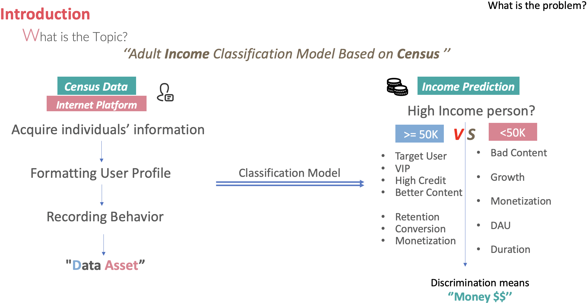
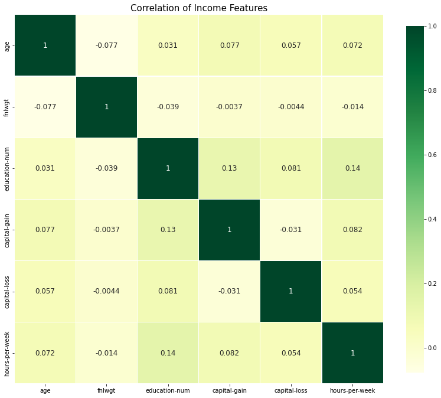
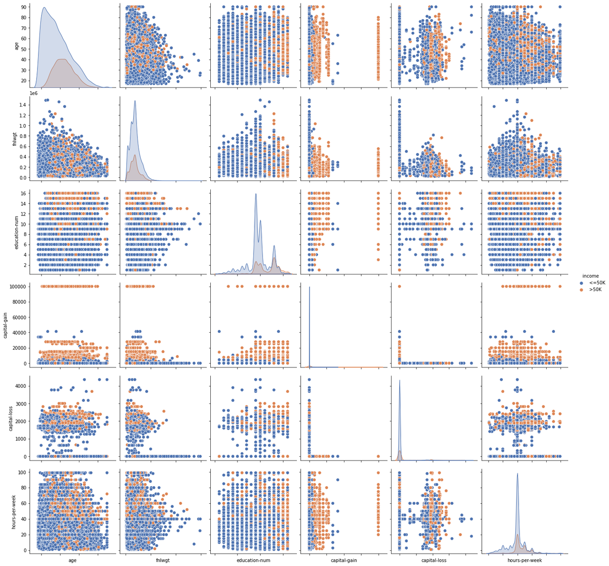
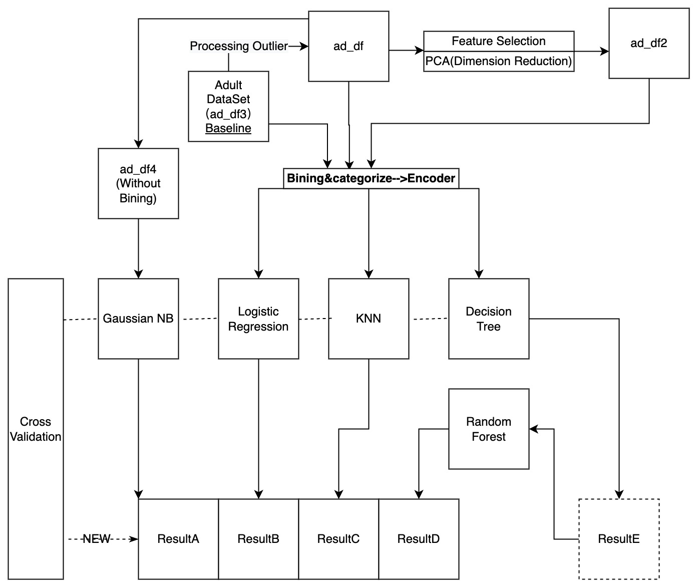

# Adult_Income_ML-Project
 

**Quick Portal**

| **--->** [1.Script](/Adult_Income_Project-From-Scratch-/blob/main/Income_Classification_Final.ipynb) | 

| **--->** [2.Project-Report](/Adult_Income_Project-From-Scratch-/blob/main/IE7374%20Final%20Project%20-%20Lark) |

| **--->** [3.Presentation-Slide](/Adult_Income_Project-From-Scratch-/blob/main/Pre-7374-final.pdf) |

## 1.Introduction
- **Objective**: Basically, in this project, the objective of this machine learning project is to predict whether a person makes over 50K a year. We are going to focus on building an 'income' classification model. All of these are the prerequisite of default risk modeling.
- **Method**: For one thing, we apply EDA to understand data from univariate to multivariate analysis, apply Feature Engineering to Bining, encode and scaling, also apply hypothesis testing to do feature selection. For another, we write 7 algorithms scratch without using Sklearn, which includes 1 dimension reduction, and 6 classification algorithms to train our model and evaluate the goal by metrics. 
- **Comparation**: Finally, we set the 4 dataset scenario including baseline(ad_df)and the other 3 dataset by improvement, and compare the model from metrics perspective, bias-variance-tradeoff perspective, optimization perspective and space and time consumption perspective to conduct model selection and explore the interpretability.
## 2.Bussiness Value
- All we know that We are naked in Big data society, The user information are collected in every APP and Website includes data on age, gender, country of origin, marital status,marriage, education etc.) when we login in to them.
- Typically, all of this information(Data Asset) would be widely used by Bank, Fintech company and IBD for deciding whether to approve their application of card and account,  evaluating cardholder's credit, anticipating risk of default and fraud in finance, differentiating the value of bond or interest and commission rate for different applicators and even introducing typical monetization method--- ***Advertisement***.

    

    
    

### 3.About Data 
#### 3.1 Data Source： [Adult_data_UCI](/https://archive.ics.uci.edu/ml/datasets/adult) 
- It is the multivariable data set. And it has 48842 instances and 14 attributes. Among the15 indicators, 6 indicators are continuous indicators, and the remaining 9 indicators are discrete indicators.
#### 3.2 Input Data:
- We can see that there are 3 files:"adult.names","adult.data"and "adult.test",on Adult dataset downloaded from [Adult_data_UCI](/https://archive.ics.uci.edu/ml/datasets/adult) 
Therefore, We need to preprocess and merge all of 3 files into 1 dataset in order to do EDA and Feature Engineering and so on.
Here, we use powerful tools-- Regular Expression to deal with this problem.

### 4.Preprocessing
#### 4.1 Processing NA Value
#### 4.2 EDA
 * Statistical Analysis
      
     - Age: Range from 19 to 90 years, average is 37.
     - Education_num: from 1 to 16 ,the avg education level is 10 years.
     - hours.per.week:from 1 and 99, and the average is 40 hours.
 * Univariate Analysis 
 * Binary analysis(Heatmap-Correlation)
    

    
    

    
    - 1st: The hours-per-week are highest positive related with capital gain.
    
    - 2nd: The Educational-num are positive related with capital loss
    
    - 3rd: Age vs capital-gain
 * Multivariate analysis(Pairplot)
    

    
    

    
  - 1.Age:  present right-skew tendency, especially for income<=50k
  - 2.Hours-per-week: it seems to be the present standard tendency.
  - 3.Capital-gain and capital-loss:  
    - There are too many '0' values here, especially for income<=50k, so both of them are the sparse features. We need to deal with it.
    - There is a lot of polarization, either clustered around 0 or very high-income groups, which also reflects the ‘2:8’ rule of social wealth distribution.
  - 4.Education-num： it seems high education level have more person income》=50K
  - 5.Hours-per-week: it shows that the more hours per week a person works, the more income they have.

### 5.Feature Engineering
- Work Flow
    

    
    

  After Data Clean--> EDA --> Feature Engineerning, we have 4 dataset(ad_df, ad_df3, ad_df2, ad_df_GNB) for using.
  
### 6.Algorithm
- The general workflow is that:
  - 1st: Seting ad_df3 as Baseline(Do nothing), and seting others as controll group by different preprocessing step.
  - 2nd: After Feature engineerning, puting all ad_dfx into 5 different algorthim,let ad_df4 alone into GNB(Gaussian assumption). 
  - 3rd: Comparing metrics(Accuracy,recall,precision,F-1 Score).
  - 4th: K-fold cross validation and tuning.
  - 5th: Model selection.
 

